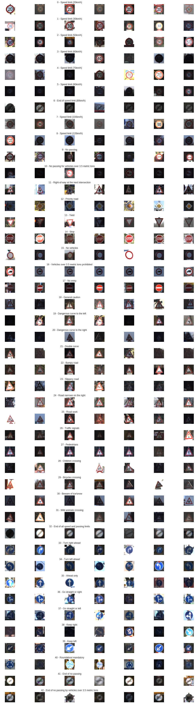
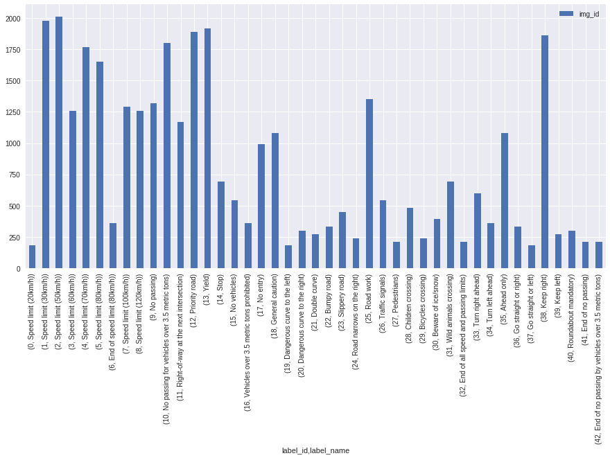
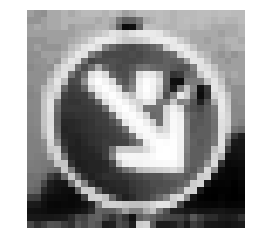
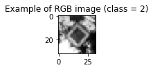
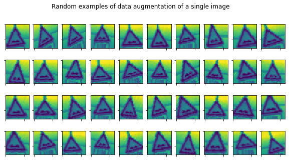
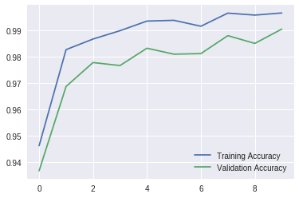
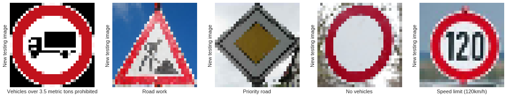
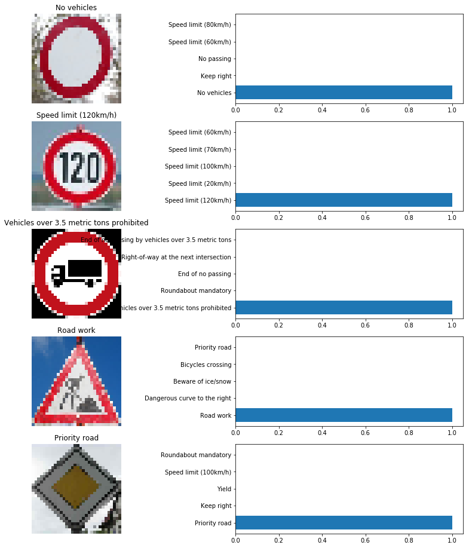

## Project: Build a Traffic Sign Recognition Program
[](http://www.udacity.com/drive)

# German Traffic Sign Classification Using TensorFlow
---
**Abstract**

This project shows how to classify German traffic signs using a LeNet neural network. (See e.g. Yann LeCu - Gradiant-Based Learning Applied to Document Recognition)

The steps of this project are the following:

---
- **1. Load The Data Set**
- **2. Dataset Summary & Exploration**
- **3. Data Preprocessing**.
    - Shuffling.
    - Gray scaling.
    - Local Histogram Equalization.
    - Normalization.
- **4. Design a Model Architecture**
    - LeNet-5.
- **5. Model Training and Evaluation**
- **6. Testing the Model Using the Test Set**
- **7. Testing the Model on New Images**


***1. Load the data set***
Download the dataset from [here](https://s3-us-west-1.amazonaws.com/udacity-selfdrivingcar/traffic-signs-data.zip). This is a pickled dataset in which we've already resized the images to 32x32.

We already have three `.p` files of 32x32 resized images:
- `train.p`: The training set.
- `test.p`: The testing set.
- `valid.p`: The validation set.

We will use Python `pickle` to load the data.

***Dataset Summary ***
I used the numpy library to calculate summary statistics of the traffic signs data set:

The size of training set is 34799
The size of the validation set is 4410
The size of test set is 12630
The shape of a traffic sign image is (32, 32, 3)
The number of unique classes/labels in the data set is 43


***2. Dataset Summary & Exploration ***
The pickled data is a dictionary with 4 key/value pairs:

- `'features'` is a 4D array containing raw pixel data of the traffic sign images, (num examples, width, height, channels).
- `'labels'` is a 1D array containing the label/class id of the traffic sign. The file `signnames.csv` contains id -> name mappings for each id.
- `'sizes'` is a list containing tuples, (width, height) representing the original width and height the image.
- `'coords'` is a list containing tuples, (x1, y1, x2, y2) representing coordinates of a bounding box around the sign in the image.

**First, we will use `numpy` provide the number of images in each subset, in addition to the image size, and the number of unique classes.**
Number of training examples:  34799
Number of testing examples:  12630
Number of validation examples:  4410
Image data shape = (32, 32, 3)
Number of classes = 43

**Then, we used `matplotlib` plot sample images .**



**And finally, we will use `numpy` to plot a histogram of the count of images in each unique class.**




#### Class Label distributed in both training and testing set

**Observations :**

* Data has strong imbalance among classes.
* Some are over represented and while other are less.
* Data distribution is almost same between training and test set.

---


## 3.  Data Preprocessing

In this step, we will apply several preprocessing steps to the input images to achieve the best possible results.

**We will use the following preprocessing techniques:**
1. Shuffling.
2. Grayscaling.
3. Local Histogram Equalization.
4. Normalization.

* **Shuffling** - Shuffle help the training data to increase randomness and variety in training dataset, in order for the model to be more stable. We will use sklearn to shuffle our data
* **Grayscaling** - Opencv to convert RGB image 3 to grayscale 1 channel.It helps process efficiency , increase ConvNet's accuracy .. Reference: [Traffic Sign Recognition with Multi-Scale Convolutional Networks](http://yann.lecun.com/exdb/publis/pdf/sermanet-ijcnn-11.pdf) paper
* **EqualizeHist** - method used to adjust areas of lower local contrast to gain a higher contrast in images.It takes grayscale image as input. Function `cv2.equalizeHist(img)`
* **Normalize** - Normalization is a process that changes the range of pixel intensity values.This feature scaling is known to have beneficial effects on the gradient descent performed by the optimizer.

* **Orginal Image before preprocessing**:


* **Orginal Image after preprocessing**:



#### Data prepration :

* As our data is class imbalanced and best is to generate additional variety of data. 
* Using keras library, class: ImageDataGenerator - Process called data Augmentation
    - Training images are randomly shift (width)
    - Training images are randomly shift (height)
    - Training images zoomed
    - Training images rotated in narrow range.
* Augmented data is displayed below sample 15 


**Sample Image** :



**Data Augmentation on sample Image**



---

## 4. Design a Model Architecture

### LeNet-5

LeNet-5 is a Convolutional network designed for handwritten and machine-printed character recognition. It was introduced by the famous Yann LeCun in his paper Gradient-Based Learning Applied to Document Recognition in 1998. Although this ConvNet is intended to classify hand-written digits, we're confident it have a very high accuracy when dealing with traffic signs, given that both hand-written digits and traffic signs are given to the computer in the form of pixel images.

**LeNet-5 architecture:**

This ConvNet follows these steps: Adding few convolution layers

**Input => Shape 32x32x1**

**Layer 1 (Convolutional)**: The output shape should be 28x28x60.

**Activation** : Relu

**Layer 2 (Convolutional)**: The output shape should be 24x24x60.

**Activation** : Relu

**Pooling 1**: The output shape should be 12x12x60.

**Layer 3 (Convolutional)**: The output shape should be 10x10x30.

**Activation**: Relu

**Layer 4 (Convolutional)**: The output shape should be 8x8x30.

**Activation**: Relu

**Pooling**: The output shape should be 4x4x30.

**Flattening**: Flatten the output shape of the final pooling layer such that it's 1D instead of 3D input shape 480 (4x4x30).

**Dense Layer 1 (Fully Connected)**: This should have 500 outputs.

**Activation**: Relu

**Dropout layer 1**

**Dense Layer 2 (Fully Connected)**: This should have 100 outputs.

**Activation**: Relu

**Dropout layer 2**

**Dense Layer 3 (Fully Connected)**: This should have 43 outputs.


Layer 											|	Shape
----- 											| -----
Input 											|32x32x3
Convolution (valid, 5x5x60),Activation (RelU)	|28x28x60
Convolution (valid, 5x5x60),Activation (RelU)	|24X24X60
Max Pooling (valid, 2x2)						|12x12x30
Convolution (valid, 3x3x60),Activation (RelU)	|10x10x30
Convolution (valid, 3x3x60),Activation (RelU)	|8X8X30
Max Pooling (valid, 2x2)						|4x4x30
Flatten											|480
Dense(Activation (ReLU)) 						|500
dropout											|0.5
Dense(Activation(Relu))							|100
dropout											|0.5
Dense											|43
Activation (Softmax)							|43


## 5. Model Training and Evaluation

In this step, we will train our model using `(X_train_norm)`, then we'll compute softmax cross entropy between `logits` and `labels` to measure the model's error probability.

The `keep_prob` variables will be used to control the dropout rate when training the neural network.
Over-fitting is a serious problem in deep neural networks. Dropout is a technique for addressing this problem.
The key idea is to randomly drop units (along with their connections) from the neural network during training. This prevents units from co-adapting too much. During training, dropout samples from an exponential number of different “thinned” networks. At test time, it is easy to approximate the effect of averaging the predictions of all these thinned networks by simply using a single unthinned network that has smaller weights.

Now, we'll run the training data through the training pipeline to train the model.
- Before each epoch, we'll shuffle the training set.
- After each epoch, we measure the loss and accuracy of the validation set.
- And after training, we will save the model.
- A low accuracy on the training and validation sets imply underfitting. A high accuracy on the training set but low accuracy on the validation set implies overfitting.

**Parameters**:
`
BATCHSIZE = 100
EPOCHS = 10
BATCHES_PER_EPOCH = 2000
learning rate = 0.001
drop1 layer keep prob = 0.5
drop2 layer keep prob = 0.5
`

### Model accuracy :
```
Training...
EPOCH 1 ...
Train Accuracy = 0.940 - Validation Accuracy: 0.922

EPOCH 2 ...
Train Accuracy = 0.976 - Validation Accuracy: 0.968

EPOCH 3 ...
Train Accuracy = 0.989 - Validation Accuracy: 0.980

EPOCH 4 ...
Train Accuracy = 0.988 - Validation Accuracy: 0.981

EPOCH 5 ...
Train Accuracy = 0.994 - Validation Accuracy: 0.988

EPOCH 6 ...
Train Accuracy = 0.994 - Validation Accuracy: 0.986

EPOCH 7 ...
Train Accuracy = 0.996 - Validation Accuracy: 0.991

EPOCH 8 ...
Train Accuracy = 0.996 - Validation Accuracy: 0.992

EPOCH 9 ...
Train Accuracy = 0.996 - Validation Accuracy: 0.990

EPOCH 10 ...
Train Accuracy = 0.997 - Validation Accuracy: 0.993

```


#### Observations  Train set vs Validation set :

* Train Accuracy - 0.997
* Validation Accuracy - 0.993

As training accuracy is slightly higher than the validation accuracy, I think our model is performing well.

I tried changing layer by layer but changing all three did not help in gaining more accuracy, where as dropout and shuffling of data help a lot in improving accuracy.

## 6. Testing the Model Using the Test Set

#### Observations  Train set vs Test set :

***Test Accuracy - 0.97**

except few classes all other percentage accuracy greater than 90%

```                                  
 6 End of speed limit (80km/h)                          89.33%  360

 18 General caution                                     88.21% 1080

 30 Beware of ice/snow                                  88.00%  390

 42 End of no passing by vehicles over 3.5 metric tons  87.78%  210

 27 Pedestrians                                         50.00%  210
```


### 7. Test on New Images

**Load new Image**



**Result**
```
Image 0 - Target = 15, Predicted = 15
Image 1 - Target = 08, Predicted = 08
Image 2 - Target = 16, Predicted = 16
Image 3 - Target = 25, Predicted = 25
Image 4 - Target = 12, Predicted = 12
Model accuracy: 1.00
```

Test Accuracy = 100.0%.
In all cases, the model was very certain (80% - 100%).

***Model Certainty - Softmax Probabilities***
The images downloaded from the web have the top five softmax probabilities of the predictions on the captured images are outputted.



### Possible Future Work
1. Augmentation of Training Data
Augmenting the training set might help improve model performance. Common data augmentation techniques include rotation, translation, zoom, flips, inserting jitter, and/or color perturbation. I would use OpenCV for most of the image processing activities.

2. Analyze the New Image Performance in more detail
All traffic sign images that I used for testing the predictions worked very well. It would be interesting how the model performs in case there are traffic sign that are less similar to the traffic signs in the training set. Examples could be traffic signs drawn manually or traffic signs with a label that was not defined in the training set.

***Conclusion:**
  - As we can see the models accuracy gets saturated after some epochs, so the best number in current architecture for epoch is 10, so that we will not overfit the model.

 File Location for reference:
* [HTML file](./Traffic_Sign_Classifier.html) Project code saved as HTML file
* [Project Code](./Traffic_Sign_Classifier.ipynb)  Project code
* [Saved Images](./report_images/)                  Screenshots
* [New Images](./new_test_images/)                New images from web stored
* [Write_up file](./writeup_report.md)             Writeup file

